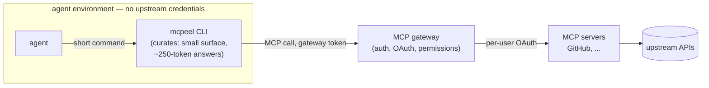

# mcpeel

Hand-built CLIs over MCP servers — designed for how agents work, not how
APIs are shaped.

The MCP ecosystem now has a server for almost everything, and gateways (like
ContextForge) centralize auth, OAuth, and permissions server-side. But raw
MCP tools are built for wiring systems together, not for an agent on a task:
sprawling schemas, API-sized payloads, several calls per question — they
burn context and add turns.

`mcpeel` is the thin layer in between. Each CLI talks to an MCP endpoint
(ideally a gateway, so credentials never enter the agent's environment) and
exposes a small, opinionated command surface designed from real agent
session data — the common question becomes one short command and a
~250-token answer. Hand-written and curated, not mechanically generated from
tool schemas.



```sh
# one digest: metadata + checks + review state + comments
github pr 123
# push, then block until CI/review feedback lands
git push && github pr --since $(git rev-parse --short HEAD) --wait
```

Errors teach the next action; operations better done locally (browsing repo
contents) are refused with a redirect to `git clone`.

## Use

Point your agent at `skills/mcpeel/SKILL.md` — setup is agent-driven.
Requires bun (or node ≥22.18) and `MCP_GATEWAY_URL` / `MCP_GATEWAY_TOKEN`.
The CLIs also run as plain scripts anywhere.

Status: early. The `github` CLI is complete and verified against the GitHub
remote MCP on bun and node. See [docs/design/github.md](docs/design/github.md).

## Design

Decisions: [docs/adr/](docs/adr/) · Evidence: [docs/research/](docs/research/)

Contributions must show their work — the observed agent problem (ideally a
session excerpt) and verification of the improvement. The metric is
tokens-per-task and turns-to-success.

## License

Apache-2.0
